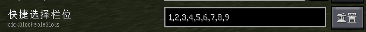

> [!TIPS]  
> 该README正在重构，目前的内容可能不完整或有误。请耐心等待更新或者Pull Request以贡献这个项目。

Litematica Printer
==================

为 Litematica 模组的 Minecraft Fabric 1.18.2 至 1.21.5 版本添加了自动建造功能。打印机允许玩家通过自动放置周围正确方块来快速还原投影。

这个仓库分支于[宅咸鱼二改版](https://github.com/zhaixianyu/litematica-printer)，添加了一些实用的功能。

下载发布版本请前往 [**Releases**](https://github.com/BiliXWhite/litematica-printer/releases)。安装前请先下载 **Litematica** 和 **MaLiLib** 两个模组，并确保已安装 **Fabric API**，最后将 jar 文件放入 `mods` 文件夹。

特性
----------

- [x] 更流畅的打印体验。
- [x] 删除了已经无法使用的破基岩功能。
- [x] 拥有填充功能(可以填充选区范围)。
- [x] 拥有使用数据包打印的功能(更快，出错更少)。
- [x] 支持服务器快捷潜影盒功能(需要服务器安装AxShulkers插件)。
- [x] 修复合成器、拉杆、红石粉不连接模式，枯叶和各种花簇的方向数量、发光浆果、带花的花盆、楼梯、藤蔓、缠怨藤、垂泪藤、砂轮、门、活版门、漏斗和箱子等等的放置问题。
- [x] 拥有放置进度条的功能。
- [x] 支持服务器卡顿检测，防止因为卡顿造成的大量方块放置错误。
- [x] 多达 48 种范围迭代逻辑。
- [x] 不会因为没水的情况下迭代到水会卡死不打印的bug

使用方法
----------

1. 在 Litematica 中加载一个投影。
2. 使你身在可以接触到投影方块的地方。
3. 按下`大写锁定（Caps Lock）`键开启打印机。
4. 享受自动的打印:)。

### 未支持方块列表
以下方块由于特殊原因暂未实现，打印机将自动跳过，亦或者是呈现错误的打印状态。如果发现其他方块放置错误，请尝试降低建造速度。若问题依旧存在，请提交 [issue](https://github.com/BiliXWhite/litematica-printer/issues)。
- 头颅,告示牌(以及具有16个朝向的任何方块)
- 实体方块（包括但不限于物品展示框、盔甲架、画等等）

编译
----------
1. 使用任意方式将源码下载至你的机器上。
2. 运行`gradlew build`进行编译。
3. 构建出来的多版本jar文件位于 `./fabricWrapper/build/libs/`内，单独版本位于`./fabricWrapper/build/tmp/submods/META-INF/jars`内。

如果你想使用IDEA进行编译，请使用以下步骤：
1. 在IDEA中打开项目。
2. 在Gradle面板中，找到`Tasks -> build`，双击`build`任务进行编译。
3. 编译完成后，构建出来的多版本jar文件位于 `./fabricWrapper/build/libs/`内，单独版本位于`./fabricWrapper/build/tmp/submods/META-INF/jars`内。

> [!TIPS]
> 在中国大陆环境可能会导致支持库下载失败。请尝试使用**代理**进行下载。
> 如果您是 Windows 11 系统及以上，则无需开启代理的全局网卡模式，该项目配置自动识别代理。

## 常见问题

### 为什么开启打印后，打印机不工作？
- 服务器装有反作弊插件，可能会导致打印机无法工作。
- `打印机工作间隔`设置过小，导致服务器无法及时响应，请尝试开启`使用数据包打印`功能打印。 
- 某些玄学问题，在开启正版验证的服务器里打印数据交互不正常。可尝试重新登陆游戏账号。（推荐使用[AuthMe](https://modrinth.com/mod/auth-me)模组） 

如果以上方法都无法解决问题，请尝试提交[Issue](https://github.com/BiliXWhite/litematica-printer/issues)，并附上详细的错误描述和日志。

### 为什么打印机放置的方块是错的？

1. 服务器装有反作弊插件，可能会导致打印机无法模拟看向放置。
2. 打印机工作间隔设置过小，服务器无法及时响应，导致方块出现错误。属于正常现象，请尝试增大`打印机工作间隔`的值。
3. 识别算法没有考虑到关于的方块，导致打印机无法正确识别方块类型。请提交[Issue](https://github.com/BiliXWhite/litematica-printer/issues)，表明什么方块出现错误。

### 快捷潜影盒功能无法使用？

1. 服务器未装有AxShulkers插件，无法使用快捷潜影盒功能。
2. 未设置好预设位置，无法使用快捷潜影盒功能。须在Litematica设置中设置好`pickBlockableSlots`值。如图所示：

快捷潜影盒仍处于测试阶段，可能会有一些问题，如果遇到问题请提交[Issue](https://github.com/BiliXWhite/litematica-printer/issues)。
