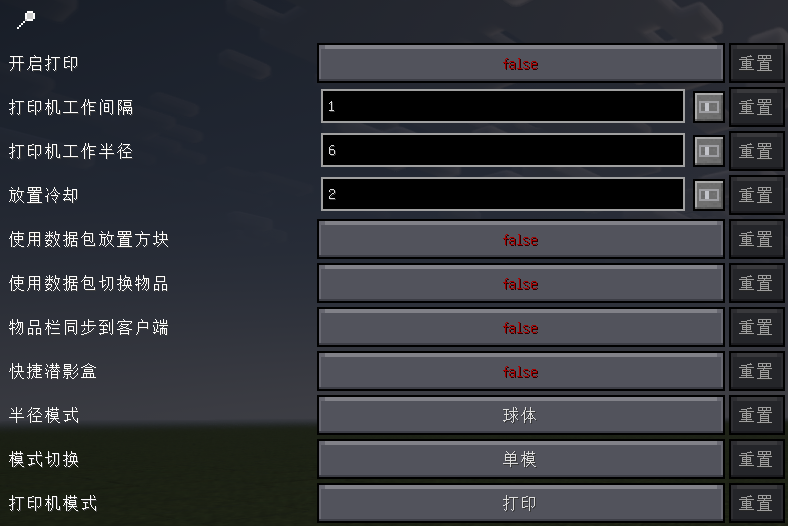

Litematica 打印机
==================
此分支为 Litematica 的 Fabric 1.18.2 至 1.21.4 版本添加了自动建造功能。打印机允许玩家通过自动放置周围正确方块来快速建造大型结构。

再分支于 宅咸鱼 的版本，添加了一些实用的功能，并且将快捷潜影盒改为适配给装有AxShulkers插件的服务器。

下载构建出的版本请访问 [Releases](https://github.com/BiliXWhite/litematica-printer/releases)。安装前请先下载 Litematica 和 MaLiLib，并确保已安装 [Fabric API](https://www.curseforge.com/minecraft/mc-mods/fabric-api/)。最后将打印机的 .jar 文件放入 mods 文件夹。

使用方法
----------
默认按 `大写锁定键（CAPS_LOCK）` 切换打印机功能。配置参数（如建造速度和范围）需按 `M + C` 打开 Litematica 设置，在"通用"标签页底部找到打印机配置。快捷键可在"热键"标签页中重新绑定。按住 `V` 键（默认）可临时启用打印机（无论当前是否开启）。

### 未支持方块列表
以下方块由于特殊原因暂未实现，打印机将自动跳过，亦或者是呈现错误的打印状态。如果发现其他方块放置错误，请尝试降低建造速度。若问题依旧存在，请提交 [issue](https://github.com/BiliXWhite/litematica-printer/issues)。
- 砂轮
- 地面放置的头颅
- 告示牌
- 发光地衣和藤蔓
- 实体（包括物品展示框和盔甲架）
- 合成器
- 楼梯

编译指南
----------
* 克隆本仓库
* 在仓库目录打开cmd
* 运行 `gradlew build` 编译
* 生成文件位于 `build/libs/`

# LiteMatica Printer 使用文档

>[!WARNING]  
>此说明文档基于 [BiliXWhite 修改版打印机](https://github.com/BiliXWhite/litematica-printer)，该版本新增多项特性。

## 快速上手

### 基础操作流程

1. **加载投影**  
    在 Litematica 中加载需要打印的建筑投影。
    
2. **准备材料**  
    确保物品栏中包含打印所需的所有方块（建议使用潜影盒整理材料）。
    
3. **启动打印**  
    按下 `CapsLock` 键开启打印，观察方块自动放置过程。
    
4. **后期修正**  
    打印完成后手动修复多属性方块（如门、活板门等）。
    

### 注意事项

- 确认游戏版本与打印机版本兼容
    
- 多人服务器使用前需了解服务器反作弊规则
    
- 首次使用建议在单人世界测试基础功能

通过以上步骤，你可以快速上手并使用LiteMatica Printer进行高效的建筑打印。

## 参数设置

> [!TIP]
> 只介绍了修改版打印机的参数设置，原版打印机的参数设置请参考[Litematica Printer](https://masa.dy.fi/mcmods/client_mods/LitematicaPrinter.html)。

在游戏中按下`Z+Y`键打开设置主页面

#### 开启打印

打印的开关状态。

#### 打印机工作间隔

每次放置的间隔，以**游戏刻度**为单位。数值越低意味着打印速度越快。

>[!TIP]
>在值为0时可能在服务器中表现效果不佳，需开启**使用数据包放置方块**，以避免放置失败或延迟问题。

#### 打印机工作半径

每次放置到的最远距离，以玩家中心为半径。数值越高意味着打印的范围越大。
此参数与[**半径模式**](#半径模式)有关联。

#### 放置冷却

当同一位置的方块没有成功放置时，等待特定的值才会再次放置。

#### 使用数据包放置方块

*\*来自BiliXWhite修改版的特性*

使用发送`PlayerInteractBlockC2SPacket`数据包的方式代替调用`rightClickBlock`函数。

可以得到更快的放置速度，并且不会出现“幽灵方块”的情况。**但是无法听到放置方块的声音，这可能影响体验。**

#### 使用数据包切换物品

*\*来自BiliXWhite修改版的特性*

使用发送`UpdateSelectedSlotC2SPacket`数据包的方式替代设置`selectedSlot`值。

可以避免在开启[使用数据包放置方块](#使用数据包放置方块)功能打印的情况下，因客户端同步不及时所导致误将错误的方块打印出来。

对于不使用[使用数据包放置方块](#使用数据包放置方块)功能并且[打印机工作间隔](#打印机工作间隔)大于1的用户来说，**无需开启这个功能**。

#### 物品栏同步到客户端

*\*来自BiliXWhite修改版的特性

在开启[使用数据包切换物品](#使用数据包切换物品)功能的情况下，会位于发送`UpdateSelectedSlotC2SPacket`数据包之后设置`selectedSlot`值。

可以修复由于[使用数据包切换物品](#使用数据包切换物品)导致的**物品栏和实际手持物品货不对板**的问题。

（因部分用户需要，故将这两个功能分开，但在后期可能会考虑删除，以简化设置选项。）

#### 快捷潜影盒

*\*来自BiliXWhite修改版的特性

> [!WARNING]
> 此功能需要服务器装有AxShulkers插件，否则无法使用。如果你是服务器管理员，可以在[AxShulkers插件页面](https://modrinth.com/plugin/axshulkers)下载并安装。

调用`clickSlot`函数右键装有目标方块的潜影盒槽。服务器装有`AxShulkers`插件的情况下，快速打开潜影盒，并拿取目标方块。

便于快速获取潜影盒内的方块。

替换的位置为Litematica的预设位置，如果所有预设位置都有濳影盒则不会替换。

#### 半径模式

打印机工作的范围模式。

- 立方体：以玩家中心为中心，以[打印机工作半径](#打印机工作半径)为半径的立方体范围内放置方块。
- 球体：以玩家中心为中心，以[打印机工作半径](#打印机工作半径)为半径的球体范围内放置方块。

立方体建议将[打印机工作半径](#打印机工作半径)设置为3，球体建议将[打印机工作半径](#打印机工作半径)设置为6。

#### 模式切换

使用单个模式或多个模式。

- **单模**：专注单一作业类型
- **多模**：支持并行处理（需谨慎配置）

#### 打印机模式

打印机的工作模式。

- 打印：正常打印。
- 基岩：利用MC特性破坏基岩，此模式下Y轴会从上往下判定。
- 挖掘：挖掘所选区内的方块。
- 流体：在“打印”的基础上，打印处有水和岩浆时默认放置沙子。

## 常见问题

#### 为什么开启打印后，打印机不工作？

有多种问题原因，请逐个排查。
1. 服务器装有反作弊插件，可能会导致打印机无法工作。
2. [打印机工作间隔](#打印机工作间隔)设置过小，导致服务器无法及时响应。
3. 某些玄学问题，在开启正版验证的服务器里打印数据交互不正常。可尝试重新登陆游戏账号。（推荐使用[AuthMe](https://modrinth.com/mod/auth-me)模组）
如果以上方法都无法解决问题，请尝试提交[Issue](https://github.com/BiliXWhite/litematica-printer/issues)，并附上详细的错误描述和日志。

#### 为什么打印机放置的方块是错的？

对于多属性方块，如门、活板门、栅栏门等，打印机可能会放置错误的方块。这是因为打印机在放置方块时，只会判断方块的类型，而不会判断方块的属性。这种情况下，只能手动放置这些方块。

在后续的更新里，会尝试解决这个问题。

#### 快捷潜影盒功能无法使用？

有多种问题原因，请逐个排查。
1. 服务器未装有AxShulkers插件，无法使用快捷潜影盒功能。
2. 未设置好预设位置，无法使用快捷潜影盒功能。须在Litematica设置中设置好`pickBlockableSlots`值。如图所示：

快捷潜影盒仍处于测试阶段，可能会有一些问题，如果遇到问题请提交[Issue](https://github.com/BiliXWhite/litematica-printer/issues)。
